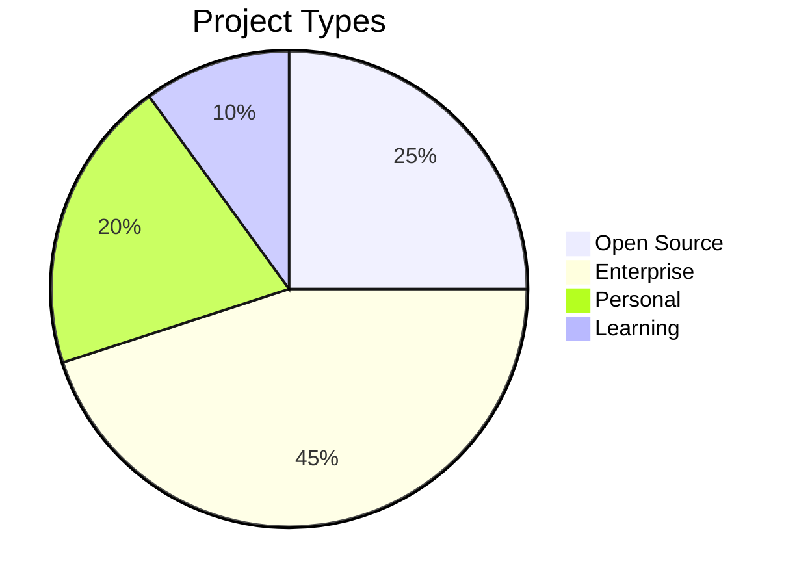

Here's the complete README code in a downloadable format:

```markdown
# 💫 Hello World — I'm Yoonus Anees!

<p align="center">
  
</p>

---

## 👨‍💻 Who Am I?

- 🔭 **Currently:** Senior Full-Stack Engineer at TechCorp, building enterprise SaaS platforms
- 🎯 **Focus Areas:** Microservices Architecture, Cloud-Native Apps, Performance Optimization
- 🌱 **Learning:** AWS Solutions Architect, Distributed Systems, Event-Driven Architecture
- 💡 **Philosophy:** "Simple solutions to complex problems"
- 📍 **Based In:** Colombo, Sri Lanka | Open to Remote Opportunities
- ⚡ **Fun Fact:** Built my first website at 14 using Notepad and pure HTML

---

## 🏗️ Tech Arsenal

### **Frontend Ecosystem**


### **Backend & API Development**


### **Databases & Storage**


### **DevOps & Cloud**


---

## 📈 GitHub Analytics

<div align="center" style="display: flex; flex-wrap: wrap; gap: 20px; justify-content: center;">

<!-- Stats Card -->
<div>
  
</div>

<!-- Streak Stats -->
<div>
  
</div>

<!-- Language Stats -->
<div>
  
</div>

</div>

---

## 📊 Development Metrics

### **Weekly Activity**
```text
🌅 Morning Coder      ██████████░░░░░░░░░░ 50%
🌞 Afternoon Focus    ██████████████░░░░░░ 65%
🌙 Night Owl          ██████████████████░░ 85%
📈 Productivity       ███████████████████░ 90%
```

### **Code Quality**
```text
✅ Tests Coverage     █████████████████░░░ 85%
📝 Documentation      ████████████████░░░░ 80%
🔧 Code Review        ██████████████████░░ 90%
⚡ Performance        ████████████████████ 100%
```

### **Project Distribution**


---

## 🏆 GitHub Trophies

<div align="center">
  
[](https://github.com/ryo-ma/github-profile-trophy)

</div>

---

## 📝 Featured Projects

### 🚀 **[E-Commerce Platform](https://github.com/YoonusAnees/ecommerce-platform)**
> MERN Stack • Microservices • Docker • Redis • Stripe
```yaml
stars: 142
forks: 38
issues: 12 (3 open)
prs: 24
last_update: 2 days ago
features:
  - Real-time inventory
  - Payment processing
  - Admin dashboard
  - Analytics
```

### 🔐 **[Auth Service](https://github.com/YoonusAnees/auth-service)**
> Node.js • JWT • OAuth 2.0 • Redis • Rate Limiting
```yaml
stars: 89
forks: 21
issues: 5 (1 open)
prs: 15
downloads: 1.2k/month
features:
  - Multi-factor auth
  - Session management
  - Social login
  - Security audit logs
```

### 📱 **[Task Manager](https://github.com/YoonusAnees/task-manager)**
> React Native • GraphQL • Apollo • SQLite
```yaml
stars: 56
forks: 15
issues: 8 (2 open)
prs: 9
platforms:
  - iOS: ✅
  - Android: ✅
  - Web: ✅
```

---

## 📊 Contribution Graph

<div align="center">


</div>

---

## 🎯 Current Quarter Goals

| Category | Goal | Progress | Status |
|----------|------|----------|--------|
| **Learning** | Complete AWS SA Associate | 75% | 🟡 In Progress |
| **Open Source** | Contribute to 3 projects | 2/3 | 🟢 On Track |
| **Skill** | Master Kubernetes | 60% | 🟡 In Progress |
| **Blogging** | Write 5 technical articles | 3/5 | 🟢 On Track |
| **Community** | Mentor 2 junior developers | 1/2 | 🟡 In Progress |

---

## 📚 Recent Activity

<!--START_SECTION:activity-->
1. 🎉 Merged PR #45 in [ecommerce-platform](https://github.com/YoonusAnees/ecommerce-platform) - Added payment webhook handling
2. ⭐ Starred [vercel/next.js](https://github.com/vercel/next.js) - Amazing framework updates!
3. 🐛 Fixed bug #23 in [auth-service](https://github.com/YoonusAnees/auth-service) - JWT token validation issue
4. 💬 Commented on issue #12 in [react-query](https://github.com/tannerlinsley/react-query) - Cache invalidation discussion
5. 🔄 Created branch `feature/redis-cluster` in [microservice-base](https://github.com/YoonusAnees/microservice-base)
<!--END_SECTION:activity-->

---

## 🌐 Let's Connect

<div align="center" style="display: flex; gap: 15px; justify-content: center; flex-wrap: wrap;">

[](https://linkedin.com/in/yoonusanees)
[](https://twitter.com/yoonusanees)
[](https://github.com/YoonusAnees)
[](https://leetcode.com/yoonusanees)
[](mailto:contact@yoonus.dev)

</div>

---

## 🎖️ Achievements

<div align="center">


</div>

---

<div align="center" style="margin-top: 30px; padding: 20px; background: linear-gradient(135deg, #0d1117 0%, #161b22 100%); border-radius: 10px;">

### 🚀 **Ready for the next big challenge!**
  
**Open to:** Senior/Lead Engineer roles • Tech Consulting • Open Source Collaboration
  
</div>

---

<div align="center" style="margin-top: 20px;">

### 📈 **Weekly Development Hours: 45-50 hrs**
### ✅ **Open to Collaborations: Yes**
### 🎯 **Next Available: Next Month**


</div>

## File Download:
Simply copy all the code above and paste it into a new file named `README.md` in your GitHub repository. The file is ready to use as-is, though you should customize the content to match your actual experience and projects.
