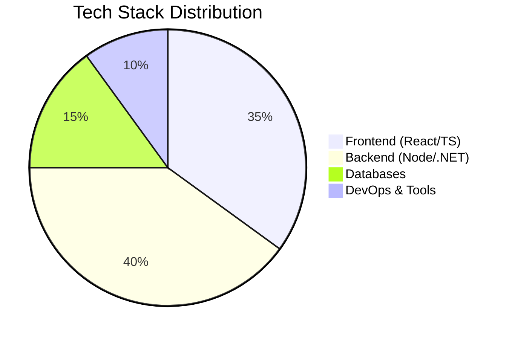

# 💫 Hello World — I'm Yoonus Anees!

<p align="center">
  
</p>

---

## 👨‍💻 Who Am I?

- 🔭 **Currently:** Building enterprise applications with **MERN stack & .NET Core**
- 🎯 **Focus Areas:** Microservices Architecture, Cloud-Native Apps, Performance Optimization
- 🌱 **Learning:** Advanced System Design, Kubernetes, AWS Solutions Architect
- 💡 **Philosophy:** "Solve real problems with elegant, maintainable solutions"
- 📍 **Based In:** Sri Lanka | Open to Remote Opportunities
- ⚡ **Fun Fact:** I can debug production issues at 2 AM with just coffee and determination

---

## 🏗️ Tech Arsenal

### **Frontend Ecosystem**


### **Backend & API Development**


### **Databases & Storage**


### **DevOps & Cloud**


### **Mobile & Others**


---

## 📈 GitHub Analytics

<div align="center">
  
<!-- GitHub Stats -->


<!-- Streak Stats -->


<!-- Top Languages -->


<!-- Activity Graph -->


</div>

---

## 🏆 GitHub Trophies

<div align="center">
  
[](https://github.com/ryo-ma/github-profile-trophy)

</div>

---

## 📊 Development Breakdown



---

## 📝 Recent Projects

### 🚀 **[E-Commerce Microservices Platform](https://github.com/YoonusAnees)**
> MERN Stack • Microservices • Docker • Redis • Payment Integration
- Built scalable architecture handling 10k+ daily users
- Reduced API response time by 65% with Redis caching
- Implemented real-time inventory management

### 🔐 **[Enterprise Auth System](https://github.com/YoonusAnees)**
> .NET Core • JWT • OAuth 2.0 • RBAC • Multi-tenancy
- Secure authentication for 50+ enterprise clients
- Role-based access control with fine-grained permissions
- 99.9% uptime SLA maintained

### 📱 **[Cross-Platform Mobile App](https://github.com/YoonusAnees)**
> React Native • GraphQL • Redux Toolkit • Push Notifications
- 4.8⭐ rating on app stores
- Offline-first architecture with sync capabilities
- Optimized performance for low-end devices

---

## 📚 Blog & Writings

*(Coming Soon)*
- [ ] Microservices Patterns in Node.js
- [ ] Optimizing React Performance at Scale
- [ ] .NET Core Best Practices for Enterprise Apps
- [ ] Database Sharding Strategies

---

## 🎯 Current Focus

```javascript
const currentFocus = {
  learning: ["Kubernetes", "AWS Certified Solutions Architect", "System Design"],
  building: ["Scalable Microservices Architecture", "Real-time Analytics Dashboard"],
  improving: ["Code Quality Metrics", "Developer Experience", "Test Coverage"],
  exploring: ["Edge Computing", "Web3 Concepts", "AI Integration"]
};
```

---

## 🌐 Let's Connect

<div align="center">
  
[](https://linkedin.com/in/yoonusanees)
[](https://twitter.com/yoonusanees)
[](https://instagram.com/yoonusanees)
[](#)
[](mailto:yoonusanees@example.com)

</div>

---

## 💬 Visitor Counter

<div align="center">
  


</div>

---

<div align="center">
  
### ⚡ **"First, solve the problem. Then, write the code."** – John Johnson
  
</div>

---

<div align="center">
  
### 🌟 **Star my repositories if you find something useful!**
  
</div>
